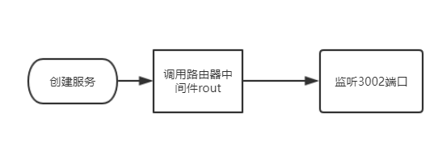
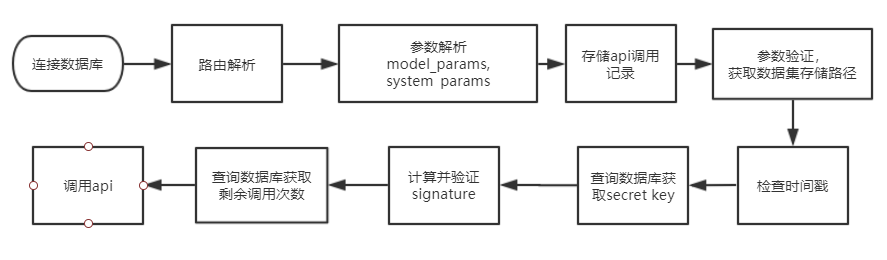
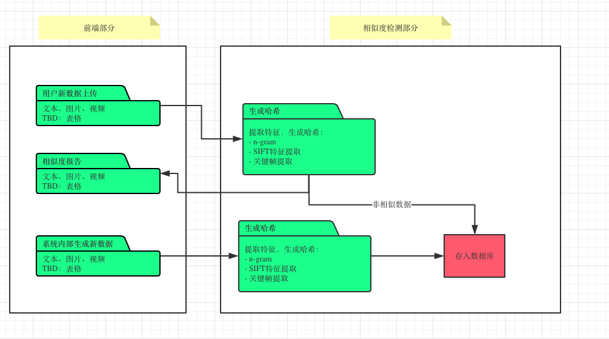
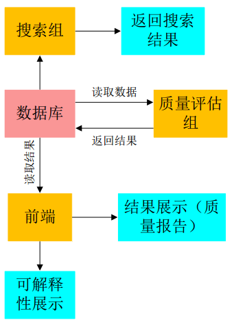

## 功能模块说明

此部分是为了便于合作开发，将模块的相关说明写于此处，以方便对接。

- **功能概述**：说明模块的功能，和调用此模块的场景
- **时间安排**：2019.03.20---2019.03.25
- **开发状态**：已完成、测试中、正在进行、有待开发。
- **负责人**：负责此模块开发的负责人
- **运行环境**：正常运行此模块所需的环境，例如python程序，在服务器上运行时是使用哪个虚拟环境
- **部署位置**：服务器存放此程序的位置
- **输入参数及说明**：
   - 参数1名称，类型，含义
   - 参数2名称，类型，含义
   - .....
- **输出参数及说明**：输出的结果应为数据库中的位置信息，或可以直接返回的数值信息，如果是较为复杂的结果，例如程序产生的是json文件，在说明文件地址的同时要声明json文件格式。
   - 结果变量1名称，类型，含义
   - result.json例如
```javascript
{
	"dataType":"字符串类型,代表数据类型,和表中的content_type不同,是用户在上传数据集时设置的.下述所有string类型大小限制可为512字符",
	"dataFunction":"字符串类型,代表数据集的功能,和表中的application_field不同,是用户在上传数据集时设置的描述数据功能的自然语言.",
	"attributeSet":{//设置数据属性相关的信息
		"whetherReGenerate":false,//是否可再生？
		"whetherTimeSentivite":false,//时间敏感？
		"whetherExclusive":false//使用排他性？（允许多个买家同时使用？）
	},
	"collectionSet":{//针对于数据收集的配置描述
		"timeSpan":[1545133206808,1545133206808],//收集数据的时间区间,是两个Date类型数据构成的数组
		"locationSpan":"收集数据的地理位置,使用string类型",
		"otherInfo":"其他能够描述数据生成设置的语句,例如该数据是从嘈杂环境采集的人声数据.string类型",
		"sourceUrl":"只应用于平台采集数据使用,不开放给上传者填写,string类型"
	},
	"totalInfo":"用户或平台填写的,描述整体信息的语句,上述信息都可以以字符串格式存在此处,是至少应有的描述信息"
}
```
   - .....
- **调用示例与结果**：给出调用模块的命令，以及返回的示例结果
- **模块内部异常处理机制**：
   - 说明模块内部的异常处理机制与异常码定义，在例如“输入错误”等常见情况下能够检测出
   - 返回结果中应包含状态码和错误信息：例如flag=0为正常执行，flag=101为某种异常，errorMsg=xxxx为异常信息
   - 或者通过log文件记录异常，而非在结果中返回异常信息
- **其他说明与补充**

### API

#### app
- **功能概述**
   - 创建服务，监听3002端口
   - 解析收到的api调用请求
   - 验证参数
   - 调用api，并返回结果
   - 更新数据库，存储调用记录等
- **开发状态**：已完成
- **负责人**
   - lmj123@mail.ustc.edu.cn
- **运行环境**：nodejs
- **部署位置**:跳板机
- **输入参数及说明**

| 名称          | 类型 | 说明                                                         |
| ------------- | ---- | ------------------------------------------------------------ |
| system_params | JSON | 系统参数，包括api_id,dataset_id,api_key,timestamp,signature，详见[模型文档](https://222.195.92.29/owncloud/index.php/apps/files/?dir=/api%E7%BB%84%E6%96%87%E6%A1%A3%E5%85%B1%E4%BA%AB/%E6%A8%A1%E5%9E%8B%E6%96%87%E6%A1%A3&fileid=1493226) |
| model_params  | JSON | 模型参数，详见[模型文档](https://222.195.92.29/owncloud/index.php/apps/files/?dir=/api%E7%BB%84%E6%96%87%E6%A1%A3%E5%85%B1%E4%BA%AB/%E6%A8%A1%E5%9E%8B%E6%96%87%E6%A1%A3&fileid=1493226) |

- **输出参数及说明**

| 名称        | 类型       | 说明                                                        |
| ----------- | ---------- | ----------------------------------------------------------- |
| status_code | int        | 表示调用状态。400表示调用成功，其他值表示调用出现相应的错误 |
| accuracy    | dictionary | 表示交叉验证的模型精度                                      |

- **调用示例与结果**
   - 请求示例

    ~~~javascript
    var client = request.newClient('http://localhost:3002/');

    var request = {
           model_params : {
                       k: 5,
                       metric:"minkowski",
                       cv:5
                       },

           system_params:{
                       api_id : 2,
                       dataset_id : 2,
                       api_key:"xxx",
                       signature:"xxx",
                       timestamp:2018xxx,
                       }

           }

    client.post('/model', request, function(err, res, body) {
     //nothing
    });
    ~~~

   - 返回示例

   ~~~javascript
   //成功示例
   status_code = 400!
   accuracy = {"0":0.9206349206349206,"1":0.8492063492063492,"2":0.9285714285714286,"3":0.9596774193548387,"4":0.8780487804878049}

   //失败示例
   the api_key doesnt exist!

   ~~~


- **程序内部异常处理机制**

   - 捕捉异步异常，返回状态码，程序不崩溃。（有待开发）
- **其他说明与补充**
   - 算法流程
      - app 
      - rout 


#### real-time-process
- **功能概述**
   - 传输模型训练进度信息给前端，用于绘制模型训练过程中实时的精度、loss变化，以及进度条。
   - 需要前端创建tcp socket server，用于接收数据
- **开发状态**：已完成
- **负责人**
   - yang12@mail.ustc.edu.cn
- **运行环境**
   - python3
   - 要求前端提前开启tcp socket server。
- **部署位置**
   - /datapool/workspace/jiangshanyang/ml_model/arith
- **输入参数及说明**

| 名称 | 类型   | 来源     | 说明                                                         |
| ---- | ------ | -------- | ------------------------------------------------------------ |
| ip   | string | nodejs端 | tcp socket server的地址。<br>由前端转交nodejs端，再由nodejs端传给python代码 |

- **输出参数及说明**

| 名称           | 类型   | 目的地            | 说明                                         |
| -------------- | ------ | ----------------- | -------------------------------------------- |
| Train_test_tag | bool   | tcp socket server | 标记，区分当前状态。1为训练信息，0位验证信息 |
| Progress_epoch | float  | tcp socket server | 当前训练或者验证的epoch进度                  |
| Loss           | float  | tcp socket server | 当前训练或者验证的Loss值                     |
| Accuracy       | float  | tcp socket server | 当前训练或者验证的准确度accuracy             |
| result_url     | string | nodejs端          | 运行结果的存储路径                           |
| accuracy       | json   | nodejs端          | 模型精度                                     |

- **调用示例与结果**
- **程序内部异常处理机制**
   - 检测tcp socket server端是否开启。（有待开发）
   - 出错时返回相应的状态信息。（有待开发）
- **其他说明与补充**
   - 算法流程
      - 接受nodejs端的调用请求及参数
      - 导入数据集
      - 训练神经网络
      - 与tcp socket server建立接连，并在每个训练batch结束时计算当前训练accuracy和loss，以tcp socket的方式传输给前端
      - 返回训练结果给nodejs端

### api质量评估

- **功能概述**

  - 评估api质量

- **开发状态**：有待开发

- **负责人**：lmj123@mail.ustc.edu.cn

- **运行环境**

- **部署位置**：

- **输入参数**：

  | 名称       | 类型   | 说明                                      |
  | ---------- | ------ | ----------------------------------------- |
  | api_id     | int    | 当前api的id                               |
  | dataset_id | string | 数据集id。评估当前api在相应数据集上的质量 |

- **输出参数**：

  | 名称        | 类型 | 说明    |
  | ----------- | ---- | ------- |
  | api_quality | JSON | api质量 |

- **调用示例与结果**

- **程序内部异常处理机制**

### 数据理解与检索部分

#### video_detect_keyframe
- **功能概述**
   - 抽取视频关键帧
- **开发状态**：已完成
- **负责人**： 袁牧
- **运行环境**： python3 workspace/yuanmu/yuanmu_env
- **部署位置**：
- **输入参数及说明**
   - 视频文件夹路径
   - （default）从数据库search_table中读入视频数据路径
- **输出参数及说明**
   - 于指定路径保存输出结果（pickle文件）
   - （default）更新数据库视频关键帧路径
- **调用示例与结果**
   - 查看帮助：python3 video_detect_keyframe.py -h
- **程序内部异常处理机制**


#### image_detect_object

- **功能概述**
   - 检测图片中的物体
- **开发状态**：已完成
- **负责人**：袁牧
- **运行环境**：python2 default
- **部署位置**
- **输入参数及说明**
   - 图片文件夹路径
   - （default）从数据库中读入图片文件夹路径
- **输出参数及说明**
   - 模型运行结果存储路径
   - （default）更新数据库中图片数据集的物体检测结果
- **调用示例与结果**
   - 查看帮助：python2 image_detect_object.py -h
- **程序内部异常处理机制**

#### image_classify_scene
- **功能概述**
   - 识别图片的场景类别
- **开发状态**
- **负责人**
- **运行环境**
- **部署位置**
- **输入参数及说明**
   - 图片文件夹路径
- **输出参数及说明**
   - 模型运行结果存储路径
- **调用示例与结果**
- **程序内部异常处理机制**

#### image_detect_face
- **功能概述**
   - 检测图片中的人脸
- **开发状态**
- **负责人**
- **运行环境**
- **部署位置**
- **输入参数及说明**
   - 图片文件夹路径
- **输出参数及说明**
   - 模型运行结果存储路径
- **调用示例与结果**
- **程序内部异常处理机制**

#### image_detect_skeleton
- **功能概述**
   - 检测图片中的人物骨架
- **开发状态**
- **负责人**
- **运行环境**
- **部署位置**
- **输入参数及说明**
   - 图片文件夹路径
- **输出参数及说明**
   - 模型运行结果存储路径
- **调用示例与结果**
- **程序内部异常处理机制**

#### audio_recognize_speech
- **功能概述**
   - 识别音频中的英语
- **开发状态**
- **负责人**
- **运行环境**
- **部署位置**
- **输入参数及说明**
   - 音频文件夹路径
- **输出参数及说明**
   - 模型运行结果存储路径
- **调用示例与结果**
- **程序内部异常处理机制**

#### utility_image_object-detection
- **功能概述**
   - 评估图片数据集的物体检测效用
- **开发状态**
- **负责人**
- **运行环境**
- **部署位置**
- **输入参数及说明**
   - 模型运行结果路径
- **输出参数及说明**
   - 数据集效用评估分数
- **调用示例与结果**
- **程序内部异常处理机制**

#### utility_image_face-detection
- **功能概述**
   - 评估图片数据集的人脸检测效用
- **开发状态**
- **负责人**
- **运行环境**
- **部署位置**
- **输入参数及说明**
   - 模型运行结果路径
- **输出参数及说明**
   - 数据集效用评估分数
- **调用示例与结果**
- **程序内部异常处理机制**

#### utility_image_scene-classification
- **功能概述**
   - 评估图片数据集的场景分类效用
- **开发状态**
- **负责人**
- **运行环境**
- **部署位置**
- **输入参数及说明**
   - 模型运行结果路径
- **输出参数及说明**
   - 数据集效用评估分数
- **调用示例与结果**
- **程序内部异常处理机制**
	utility_image_skeleton-detection	评估图片数据集的骨架检测效用	模型运行结果路径	数据集效用评估分数
#### utility_image_skeleton-detection
- **功能概述**
   - 评估图片数据集的骨架检测效用
- **开发状态**
- **负责人**
- **运行环境**
- **部署位置**
- **输入参数及说明**
   - 模型运行结果路径
- **输出参数及说明**
   - 数据集效用评估分数
- **调用示例与结果**
- **程序内部异常处理机制**

#### utility_audio_speech-recognition
- **功能概述**
   - 评估音频数据集的语音识别效用
- **开发状态**
- **负责人**
- **运行环境**
- **部署位置**
- **输入参数及说明**
   - 模型运行结果路径
- **输出参数及说明**
   - 数据集效用评估分数
- **调用示例与结果**
- **程序内部异常处理机制**

#### scheduler_video
- **功能概述**
   - 调度视频待运行程序
- **开发状态**
- **负责人**
- **运行环境**
- **部署位置**
- **输入参数及说明**
   - 视频数据集表
- **输出参数及说明**
- **调用示例与结果**
- **程序内部异常处理机制**

#### scheduler_image
- **功能概述**
   - 调度图片待运行程序
- **开发状态**
- **负责人**
- **运行环境**
- **部署位置**
- **输入参数及说明**
   - 图片数据集表
- **输出参数及说明**
- **调用示例与结果**
- **程序内部异常处理机制**

#### scheduler_audio
- **功能概述**
   - 调度音频待运行程序
- **开发状态**
- **负责人**
- **运行环境**
- **部署位置**
- **输入参数及说明**
   - 音频数据集表
- **输出参数及说明**
- **调用示例与结果**
- **程序内部异常处理机制**

#### scheduler_text
- **功能概述**
   - 调度文本待运行程序
- **开发状态**
- **负责人**
- **运行环境**
- **部署位置**
- **输入参数及说明**
   - 文本数据集表
- **输出参数及说明**
- **调用示例与结果**
- **程序内部异常处理机制**

#### index_dataunit
- **功能概述**
   - 构建/更新数据元的索引文件
- **开发状态**
- **负责人**
- **运行环境**
- **部署位置**
- **输入参数及说明**
   - 模型运行结果路径   
   - 数据集元信息表
- **输出参数及说明**
   - 索引文件存储路径
- **调用示例与结果**
- **程序内部异常处理机制**

#### index_dataset
- **功能概述**
   - 构建/更新数据集的索引文件
- **开发状态**
- **负责人**
- **运行环境**
- **部署位置**
- **输入参数及说明**
   - 模型运行结果路径
   - 数据集元信息表
- **输出参数及说明**
   - 索引文件存储路径
- **调用示例与结果**
- **程序内部异常处理机制**

#### search_dataunit
- **功能概述**
   - 检索数据元
- **开发状态**
- **负责人**
- **运行环境**
- **部署位置**
- **输入参数及说明**
   - query form （前端传入）
- **输出参数及说明**
   - 检索结果 （传回前端）
- **调用示例与结果**
- **程序内部异常处理机制**

#### search_dataset
- **功能概述**
   - 检索数据集
- **开发状态**
- **负责人**
- **运行环境**
- **部署位置**
- **输入参数及说明**
   - query form （前端传入）
- **输出参数及说明**
   - 检索结果 （传回前端）
- **调用示例与结果**
- **程序内部异常处理机制**

### 数据脱敏

#### text_privacy_protection
- **功能概述**

   - 文本数据脱敏

- **开发状态**：正在进行

- **负责人**：ruijiao@mail.ustc.edu.cn

- **运行环境**：python3

- **部署位置**：跳板机

- **输入参数及说明**

   | 名称          | 类型   | 说明             |
   | ------------- | ------ | ---------------- |
   | dataset_id    | String | 数据集的ID       |
   | Configuration | Json   | 用户数据脱敏配置 |

- **输出参数及说明**

   | 名称          | 类型   | 说明           |
   | ------------- | ------ | -------------- |
   | dataset       | File   | 脱敏后数据集   |
   | dataset_id    | String | 脱敏后数据集ID |
   | configuration | Json   | 脱敏参数配置   |

- **调用示例与结果**

- **程序内部异常处理机制**

#### table_privacy_protection
- **功能概述**

   - 表格数据脱敏

- **开发状态**：正在进行

- **负责人**:ruijiao@mail.ustc.edu.cn

- **运行环境**：JDK

- **部署位置**：跳板机

- **输入参数及说明**

| 名称          | 类型   | 说明             |
| ------------- | ------ | ---------------- |
| dataset_id    | String | 数据集的ID       |
| Configuration | Json   | 用户数据脱敏配置 |

- **输出参数及说明**

| 名称          | 类型   | 说明           |
| ------------- | ------ | -------------- |
| dataset       | File   | 脱敏后数据集   |
| dataset_id    | String | 脱敏后数据集ID |
| configuration | Json   | 脱敏参数配置   |

- **调用示例与结果**

- **程序内部异常处理机制**

#### image_privacy_protection
- **功能概述**

   - 图片数据脱敏

- **开发状态**：正在进行

- **负责人**：ruijiao@mail.ustc.edu.cn

- **运行环境**：python3， /datapool/workspace/jiaorui/imageInpainting

- **部署位置**：跳板机

- **输入参数及说明**

| 名称          | 类型   | 说明             |
| ------------- | ------ | ---------------- |
| dataset_id    | String | 数据集的ID       |
| Configuration | Json   | 用户数据脱敏配置 |

- **输出参数及说明**

| 名称          | 类型   | 说明           |
| ------------- | ------ | -------------- |
| dataset       | File   | 脱敏后数据集   |
| dataset_id    | String | 脱敏后数据集ID |
| configuration | Json   | 脱敏参数配置   |

- **调用示例与结果**

- **程序内部异常处理机制**

#### video_privacy_protection

- **功能概述**
  - 视频数据脱敏
- **开发状态**：有待开发
- **负责人**
- **运行环境**：
- **部署位置**
- **输入参数及说明**
- **输出参数及说明**
- **调用示例与结果**
- **程序内部异常处理机**

#### audio_privacy_protection

- **功能概述**
  - 音频数据脱敏
- **开发状态**：有待开发
- **负责人**
- **运行环境**
- **部署位置**
- **输入参数及说明**
- **输出参数及说明**
- **调用示例与结果**
- **程序内部异常处理机**

### 数据溯源与追踪



#### querySimiliar
- **功能概述**

   - 对于新数据，查询相似的数据结果，并返回相似度值和报告
- **开发状态**: 正在开发
- **负责人**: liuhuiqi@mail.ustc.edu.cn
- **运行环境**: python3.6+
- **部署位置**: 跳板服务器 `/datapool/workspace/liuhuiqi/platform_env_python3/liuhuiqi/hash_group_api.py`
- **输入参数及说明**

   - 数据集 dataset id: dataset id 为数据库中数据集对应的dataset id
- **输出参数及说明**
   结果是一个字典，转换为JSON格式，返回给主程序改JSON文件的文件地址。
   ```
   {
    'element id in dataset queried': 'similiar element id in whole dataset',
    ...
   }
   ```
- **调用示例与结果**
  调用示例和结果
  ```
  query = hash_group_api.Hash('dataset id')
  result = query.querySimiliar()
  ```
- **程序内部异常处理机制**
  对于异常，一律触发python的exception

  |异常说明|异常|
  |---|---|
  |dataset id 未输入|`ValueError`|
  |dataset id 在数据库中不存在或不唯一| 不检查|
  |数据类型不支持检查|`TypeError`|
  |element id (从dataset element表中获取的结果) 在数据库中不存在或不唯一|不检查|
  |找不到element对应的文件位置|`FileNotFoundError`|
  |FFMpeg 提取关键帧出错|`Exception`|


#### updateDatabase
- **功能概述**

   - 对于新数据，确认和现有数据不相似后，将其指纹写入数据库
- **开发状态**: 正在开发
- **负责人**: liuhuiqi@mail.ustc.edu.cn
- **运行环境**: python3.6+
- **部署位置**: 跳板服务器 `/datapool/workspace/liuhuiqi/platform_env_python3/liuhuiqi/hash_group_api.py`
- **输入参数及说明**

   - 数据集 dataset id: dataset id 为数据库中数据集对应的dataset id
- **输出参数及说明**

   - 将哈希值写入数据库(每个哈希1024比特)
- **调用示例与结果**
  调用示例和结果
  ```
  query = hash_group_api.Hash('dataset id')
  result = query.querySimiliar() # 前置条件，目前必须调用
  if condition: # 该条件由前端管理员触发
    query.updateDatabase()
  ```
- **程序内部异常处理机制**
  对于异常，一律触发python的exception

  |异常说明|异常|
  |---|---|
  |dataset id 未输入|`ValueError`|
  |dataset id 在数据库中不存在或不唯一| 不检查|
  |数据类型不支持检查|`TypeError`|
  |element id (从dataset element表中获取的结果) 在数据库中不存在或不唯一|不检查|
  |找不到element对应的文件位置|`FileNotFoundError`|
  |FFMpeg 提取关键帧出错|`Exception`|

### 数据质量评估



#### image_intrinsic_distortion_quality_assessment
- **功能概述**
   - 对图片各个失真类型，包括：白噪，高斯模糊，快速衰竭，jp2k压缩，jpeg压缩进行评估
- **开发状态**
   - 已完成
- **负责人**
- **运行环境**
   - Python 2.7, PyTorch 0.4, TensorboardX 1.2, TensorFlow-TensorBoard
- **部署位置**
   - 2号服务器
- **输入参数及说明**
   - 数据库dataset表dataset_id
- **输出参数及说明**
   - flag 程序正常结束or not
   - address json存放地址
   - 附加说明：json文件格式 image_score_result_1.json:
```javascript
{
    "image1.png":{//图片image1.png的各个失真类型分数
	"wn_score":"白噪分数",(类型：double，取值：[0,100])
	"gblur_score": "高斯模糊分数",
	"fastfading_score": "快速衰竭分数",
	"jp2k_score": "jp2k压缩分数",
	"jpeg_score": "jpeg压缩分数",
	},
}
```
- **调用示例与结果**
   - image_intrinsic_distortion_quality_assessment(dataset_id), image_score_result_1.json
- **程序内部异常处理机制**
   - flag=000，输入错误，程序抛出（图片尺寸大小异常)
   - flag=001，输入数据集dataset_id错误
   - flag=010，IO错误

#### image_intrinsic_all_quality_assessment()
- **功能概述**
   - 未知图片失真类型时，对单张图片质量进行整体内在质量评估
- **开发状态**
   - 正在进行
- **负责人**
   - 李安然
- **运行环境**
   - MATLAB
- **部署位置**
   - 2号服务器
- **输入参数及说明**
   - 数据库dataset表dataset_id
- **输出参数及说明**
   - flag 程序正常结束or not
   - address json存放地址
   - 附加说明：json文件格式 image_score_result_2.json:
```javascript
{
    "image1.png":{//图片image1.png的整体质量
	"all_score":"图片整体分数",(类型：double，取值：[0,100])
	},
}
```
- **调用示例与结果**
   - image_intrinsic_all_quality_assessment(dataset_id), image_score_result_2.json
- **程序内部异常处理机制**
   - flag=000，程序执行错误
   - flag=001，输入数据集dataset_id错误
   - flag=010，IO错误

#### image__contextual_quality_assessment()
- **功能概述**
   - 对图片集进行上下文质量评估
- **开发状态**
   - 正在进行
- **负责人**
   - 谢筠庭
- **运行环境**
   - Python
- **部署位置**
   - 跳板服务器/raid/workspace/xieyunting/
- **输入参数及说明**
   - 数据库dataset表dataset_id
- **输出参数及说明**
   - flag 程序正常结束or not
   - address json存放地址
   - 附加说明：json文件格式 image_score_result_3.json:
```javascript
{
    "dataset_id":{//图片集dataset_id的上下文质量
	"content_diversity_score":"内容多样性分数",(类型：double，取值：不小于0)
	"completness_score": "完整性分数",
	"appropriate_amount_score": "合适数据量分数",
	"timeliness_score": "时效性分数",
	},
}
```
- **调用示例与结果**
   - image_contextual_quality_assessment(dataset_id), image_score_result_3.json
- **程序内部异常处理机制**
   - flag=000，程序执行错误
   - flag=001，输入数据集dataset_id错误
   - flag=010，IO错误

#### text_intrisic_quality_assessment
- **功能概述**
   - 对文本进行多个维度的质量评估，包括：拼写正确性，语法正确性，可读性
- **开发状态**
   - 本地开发已完成，正在进行部署到服务器
- **负责人**
   - 李安然
- **运行环境**
   - Python
- **部署位置**
   - 跳板服务器
- **输入参数及说明**
   - 数据库dataset表dataset_id
- **输出参数及说明**
   - flag 程序正常结束or not
   - address json存放地址
   - 附加说明：json文件格式 text_score_result_1.json:
```javascript
{
    "text1":{//文本text1的质量
	"spelling_score":"拼写正确性分数",(类型：double，取值：[0,5])
	"grammar_score": "语法正确性分数",
	"readability_score": "可读性分数",
	"all_score": "文本总体分数分数",
	},
}
```
- **调用示例与结果**
   - text_quality_assessment(dataset_id), text_score_result_1.json
- **程序内部异常处理机制**
   - flag=000，程序执行错误
   - flag=001，输入数据集dataset_id错误
   - flag=010，IO错误

#### text__contextual_quality_assessment()
- **功能概述**
   - 对文本集进行上下文质量评估
- **开发状态**
   - 正在进行
- **负责人**
   - 李安然
- **运行环境**
   - Python
- **部署位置**
   - 跳板服务器
- **输入参数及说明**
   - 数据库dataset表dataset_id
- **输出参数及说明**
   - flag 程序正常结束or not
   - address json存放地址
   - 附加说明：json文件格式 text_score_result_2.json:
```javascript
{
    "dataset_id":{//文本集dataset_id的上下文质量
	"content_diversity_score":"内容多样性分数",(类型：double，取值：不小于0)
	"completness_score": "完整性分数",(类型：double，取值：[0,1])
	"appropriate_amount_score": "合适数据量分数",(类型：double，取值：不小于0)
	"timeliness_score": "时效性分数",(类型：double，取值：[0,1])
	},
}
```
- **调用示例与结果**
   - text_contextual_quality_assessment(dataset_id), text_score_result_2.json
- **程序内部异常处理机制**
   - flag=000，程序执行错误
   - flag=001，输入数据集dataset_id错误
   - flag=010，IO错误

#### video_quality_assessment
- **功能概述**
   - 视频质量评估
- **开发状态**
   - 总体质量评估已完成，部分维度质量维度未完成
- **负责人**
   - 李安然
- **运行环境**
   - Python
- **部署位置**
   - 跳板服务器
- **输入参数及说明**
   - 数据库dataset表dataset_id
- **输出参数及说明**
   - flag 程序正常结束or not
   - address json存放地址
   - 附加说明：json文件格式 video_score_result.json:
```javascript
{
    "dataset_id":{//视频集dataset_id的上下文质量
	"all_score":"整体质量分数",(类型：double，取值：不小于0)
	"blur_score": "视频模糊效应分数",
	"blockness_score": "块状效应分数",
	},
}
```
- **调用示例与结果**
   - video_quality_assessment(dataset_id), video_score_result.json
- **程序内部异常处理机制**
   - flag=000，程序执行错误
   - flag=001，输入数据集dataset_id错误
   - flag=010，IO错误

#### audio_quality_assessment
- **功能概述**
   - 音频质量评估
- **开发状态**
   - 总体质量评估已完成，部分维度质量维度未完成
- **负责人**
   - 李安然
- **运行环境**
   - Python
- **部署位置**
   - 跳板服务器
- **输入参数及说明**
   - 数据库dataset表dataset_id
- **输出参数及说明**
   - flag 程序正常结束or not
   - address json存放地址
   - 附加说明：json文件格式 video_score_result.json:
```javascript
{
    "dataset_id":{//音频集dataset_id的上下文质量
	"all_score":"整体质量分数",(类型：double，取值：不小于0)
	},
}
```
- **调用示例与结果**
   - audio_quality_assessment(dataset_id), audio_score_result.json
- **程序内部异常处理机制**
   - flag=000，程序执行错误
   - flag=001，输入数据集dataset_id错误
   - flag=010，IO错误

#### table_quality_assessment
- **功能概述**
   - 表格质量评估
- **开发状态**
   - 内在质量已完成，上下文质量未开始
- **负责人**
   - 谢筠庭
- **运行环境**
   - Python
- **部署位置**
   - 跳板服务器
- **输入参数及说明**
   - 表格集
- **输出参数及说明**
   - flag 程序正常结束or not
   - address json存放地址
   - 附加说明：json文件格式 table_score_result.json:
```javascript
{
    "dataset_id":{//表格集dataset_id的上下文质量
	"all_score": "整体质量分数",(类型：double，取值：不小于0)
	"Syntactic_validity_score": "语法有效性",
	"completeness": 表格完整性，
	"conciseness"：简洁性
	},
}
```
- **调用示例与结果**
   - table_quality_assessment(dataset_id), table_score_result.json
- **程序内部异常处理机制**
   - flag=000，程序执行错误
   - flag=001，输入数据集dataset_id错误
   - flag=010，IO错误

### 数据库与存储组


### 数据定价组

#### OfflineAuction

- **功能概述**

  - 各种offline拍卖机制的实现

- **开发状态**

  - 本地已完成，正在部署到服务器

- **负责人**

  - 薛爽爽

- **运行环境**

  - python3

- **部署位置**

  - 跳板服务器 `/mechaismDesign/Mechanisms_v1.py`

- **输入参数及说明**

  - AuctionID(拍卖订单编号)
  - MechanismMode（拍卖机制的编号，默认为VCG）
    - 1: VCG__mechanism
    - 2: AscendingBidAuction
    - 3: DescendingBidAuction
    - 4: UnsealedBidAuction

- **输出参数及说明**

  - WinnerID, PostPrice

- **调用示例与结果**

  ```shell
  $ python3 Mechanisms_v1.py -MID 1 -AID 001
  Winner: [01,03]  Price: 2000
  ```

- **程序内部异常处理机制**

  flag = 000: 正常

  flag = 001: 未找到AID对应的拍卖交易

  flag = 010: 未找到MID对应的机制

  flag = 100: 未能成功卖出商品


#### LimitedSupplyOnlineAuction.py

- **功能概述**

  - 在线拍卖机制，卖有限份（1或k）

- **开发状态**

  - 部分完成

- **负责人**

  - wzw9875@mail.ustc.edu.cn

- **运行环境**

  - python3

- **部署位置**

  - 跳板服务器 `/datapool/workspace/ziweiwu/LimitedSupplyOnlineAuction.py`

- **输入参数及说明**
  - AuctionID(拍卖订单编号)
  - Num(确定卖出的份数)
  - ExpectedBuyerNum(预计买家人数)

- **输出参数及说明**

  - list(WinnerID), PostPrice

- **调用示例与结果**

  ```shell
  $ python3 LimitedSupplyOnlineAuction.py -AID 001 -n 1 -e 13
  Winner: [10]  Price: 200
  ```

- **程序内部异常处理机制**

  未设置预计买家人数：不处理

  flag = 000：正常

  flag = 001：未找到AID对应的拍卖交易


#### Recommend.py

- **功能概述**

  - 在限定时间内根据买家报价帮助卖家决定卖多少份以获得最大利润

- **开发状态**

  - 本地测试完成，正在部署到服务器

- **负责人**

  - 薛爽爽 

- **运行环境**

  - python3

- **部署位置**

  - 跳板服务器 `/mechanismDesign/Recommend.py`

- **输入参数及说明**

  - AuctionID(拍卖订单编号)

- **输出参数及说明**

  - CopyNum, list(WinnerID), PostPrice

- **调用示例与结果**

  ```shell
  $ python3 Recommend.py -AID 001
  Copies: 3 Winner:[002,004,006] PostPrice: 200
  ```

- **程序内部异常处理机制**

  flag = 000：正常

  flag = 001：未找到AID对应的拍卖交易


#### ExpectedProfit.py

- **功能概述**

  - 在卖家选择模式的时候为卖家提供预估收益的参考

- **开发状态**

  - 未完成

- **负责人**

  - wzw9875@mail.ustc.edu.cn

- **运行环境**

  - python3

- **部署位置**

  - 跳板服务器 `/datapool/workspace/ziweiwu/ExpectedProfit.py`

- **输入参数及说明**

  - AuctionID(拍卖订单编号)
  - MechanismID(机制编号)

- **输出参数及说明**

  - Profit

- **调用示例与结果**

  ```shell
  $ python3 ExpectedProfit.py -AID 001 -MID 0
  Profit: xxxx
  ```

- **程序内部异常处理机制**

  flag = 000：正常

  flag = 001：未找到AID对应的拍卖交易

  flag = 010：未找到MID对应的机制