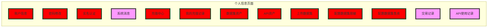

```mermaid

graph LR

classDef mainpage fill:#f9f,stroke:#333,stroke-width:4px;
classDef secondpage fill:#FF0000,stroke:#124523,stroke-width:4px;
classDef stage fill:#ccf,stroke:#f66,stroke-width:4px,stroke-dasharray:5,5;
subgraph 个人信息页面
	账户信息
	密码修改
	实名认证
	系统消息
	充值中心
	我的充值记录
	数据集资产
	API资产
	上传数据集
	配置数据集脱敏
	配置数据集售卖
	交易记录
	API使用记录
	class 系统消息,交易记录,API使用记录 mainpage;
    class 账户信息,密码修改,实名认证,充值中心,我的充值记录,数据集资产,API资产,上传数据集,配置数据集脱敏,配置数据集售卖 secondpage;
end


```

