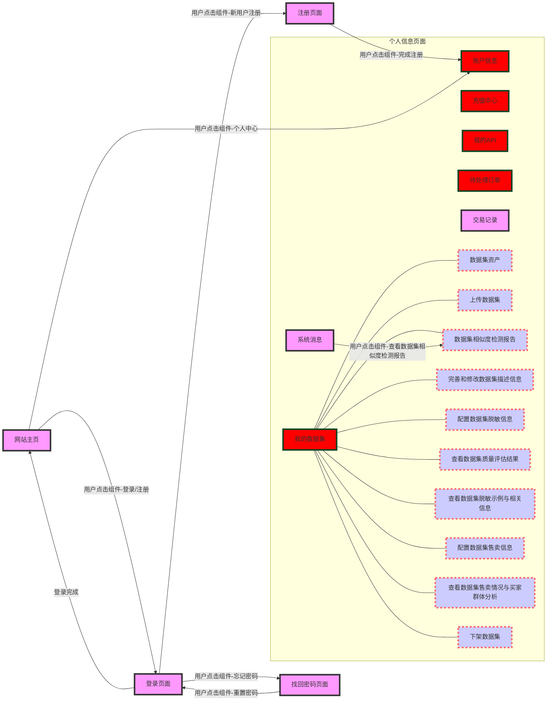

```mermaid
graph LR

classDef mainpage fill:#f9f,stroke:#333,stroke-width:4px;
classDef complexpage fill:#FF0000,stroke:#124523,stroke-width:4px;
classDef component fill:#ccf,stroke:#f66,stroke-width:4px,stroke-dasharray:5,5;
网站主页
登录页面
注册页面
找回密码页面
class 网站主页,登录页面,注册页面,找回密码页面 mainpage;

登录页面-->|登录完成|网站主页
登录页面-->|用户点击组件-新用户注册|注册页面
注册页面-->|用户点击组件-完成注册|账户信息
登录页面-->|用户点击组件-忘记密码|找回密码页面
找回密码页面-->|用户点击组件-重置密码|登录页面
网站主页-->|用户点击组件-登录/注册|登录页面
网站主页-->|用户点击组件-个人中心|账户信息

subgraph 个人信息页面
	账户信息
	系统消息
	充值中心
	我的数据集
	我的API
    待处理订单
	交易记录

    数据集资产
    上传数据集
    数据集相似度检测报告
    完善和修改数据集描述信息
    配置数据集脱敏信息
    查看数据集质量评估结果
    查看数据集脱敏示例与相关信息
    配置数据集售卖信息
    查看数据集售卖情况与买家群体分析
    下架数据集
	class 系统消息,交易记录 mainpage;
    class 账户信息,充值中心,我的数据集,我的API,待处理订单 complexpage;
    class 数据集资产,上传数据集,数据集相似度检测报告,完善和修改数据集描述信息,配置数据集脱敏信息,查看数据集质量评估结果,查看数据集脱敏示例与相关信息,配置数据集售卖信息,查看数据集售卖情况与买家群体分析,下架数据集 component;
    我的数据集---数据集资产
    我的数据集---上传数据集
    我的数据集---数据集相似度检测报告
    我的数据集---完善和修改数据集描述信息
    我的数据集---配置数据集脱敏信息
    我的数据集---查看数据集质量评估结果
    我的数据集---查看数据集脱敏示例与相关信息
    我的数据集---配置数据集售卖信息
    我的数据集---查看数据集售卖情况与买家群体分析
    我的数据集---下架数据集

    系统消息-->|用户点击组件-查看数据集相似度检测报告|数据集相似度检测报告
end

```
